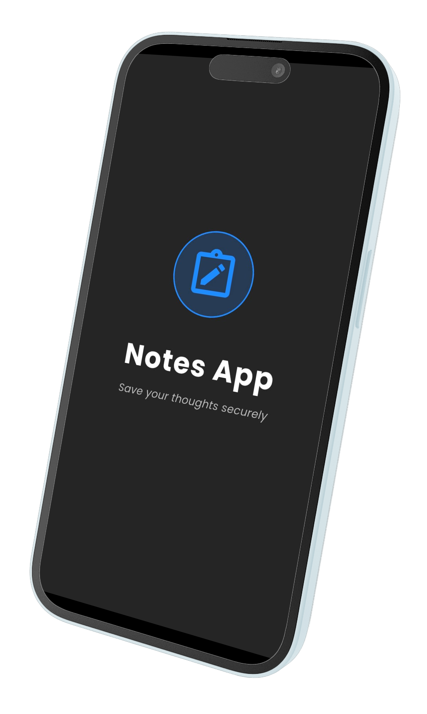
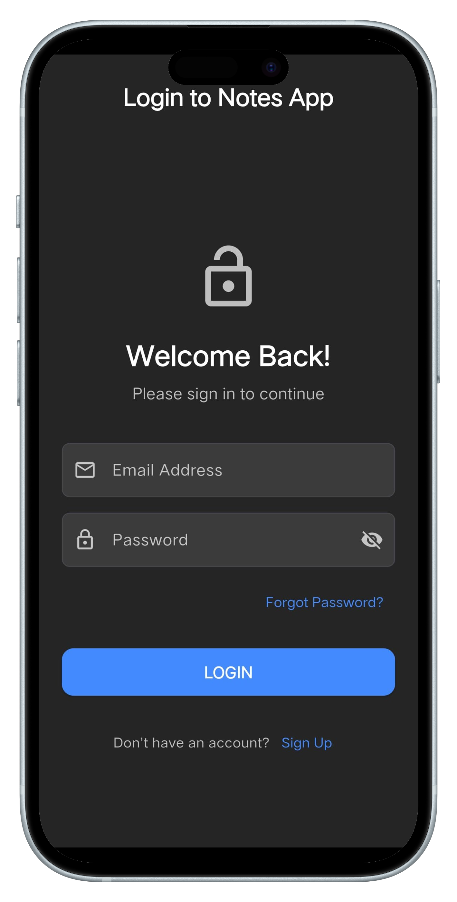
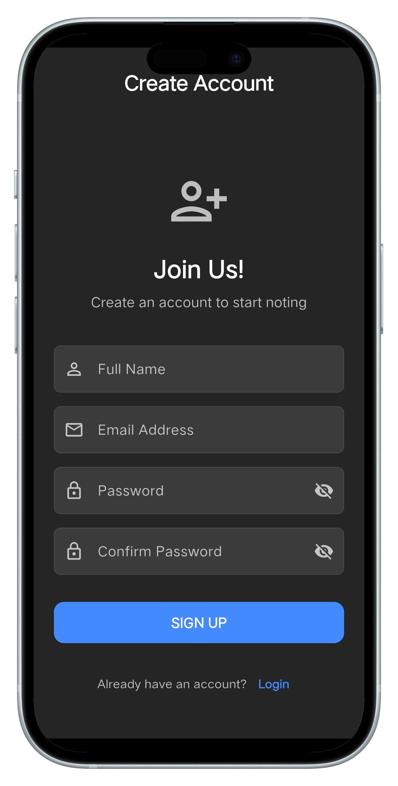
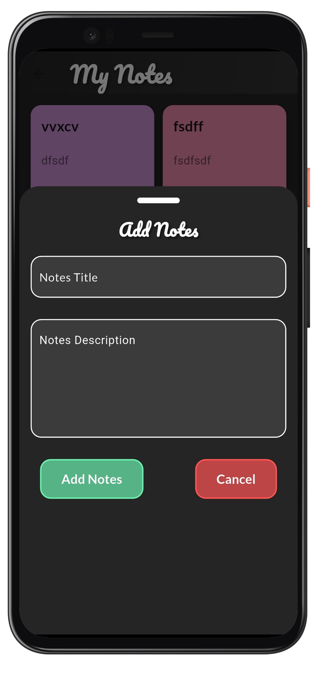

# 📝 Cloud Notes

**Cloud Notes** (`notes_firebase_app`) is a full-featured, cross-platform note-taking application built with **Flutter** and powered by **Firebase**. Designed with scalability, responsiveness, and clean architecture in mind, this app enables users to create, edit, and manage notes with real-time cloud sync across devices.

----------

## 📸 App Screenshots

| **Splash Screen** | **Login Screen** |
|-------------------|------------------|
|  | |

| **Signup Screen** | **Create Note** |
|-------------------|------------------|
|  | |

----------

## 🚀 Key Features

-   🔐 **User Authentication**: Secure sign-up/login via Firebase Authentication.
    
-   📝 **Note Management**: Create, view, edit, and delete notes with ease.
    
-   🔄 **Real-Time Sync**: Notes sync instantly using Firebase Firestore.
    
-   📱 **Multi-Platform Support**: Works on **Android**, **iOS**, **Web**, **Windows**, **Linux**, and **macOS**.
    
-   🎨 **Responsive UI**: Adaptive layout with Flutter's Material Design for all screen sizes.
    
-   🧠 **BLoC Architecture**: Clean and testable business logic separation using `flutter_bloc`.
    
-   🔔 **In-App Feedback**: Snackbars for error and success messaging.
    

----------

## 🛠️ Technologies & Tools

| Framework | Flutter |
|--|--|
| Language | Dart |
|Backend  |Firebase (Auth, Firestore, Storage)|
| State Management | flutter_bloc |
|Desktop Builds|C++ / CMake|
|iOS/macOS|Swift, C|
|Web Support|HTML|

----------

## 🧩 Architecture Overview

### 🔐 Authentication

-   Uses **Firebase Authentication** for secure user sessions.
    
-   Initialization via `Firebase.initializeApp()` in `main.dart`.
    
-   Authentication logic handled with `LoginBloc` and `SignupBloc`.
    

### 📊 State Management

-   BLoC (Business Logic Component) pattern via `flutter_bloc`.
    
-   All business logic (auth, notes) separated into dedicated BLoCs.
    
-   Integrated using `MultiBlocProvider` for scalable UI access.
    

### ☁️ Cloud Storage

-   Notes are stored in **Firebase Firestore** for cloud access.
    
-   Automatic sync across platforms using Firebase SDK.
    
-   Offline persistence and sync conflict handling supported.
    

----------

## 🧱 Project Structure

    lib/
    ├── Bloc/                 # Business logic components (BLoC)
    ├── screens/              # UI screens (Login, Signup, Notes)
    ├── firebase_options.dart # Firebase platform config
    └── main.dart             # App entry point, BLoC and Firebase init
    platforms/
    ├── ios/
    ├── android/
    ├── windows/
    ├── linux/
    └── web/

## ⚙️ Getting Started

1.  **Clone the Repository**
    
       
    `git clone https://github.com/cybersleuth0/cloud-notes.git` 
    
2.  **Install Dependencies**
    
    `flutter pub get` 
    
3.  **Set Up Firebase**
    
    -   Replace `firebase_options.dart` with your Firebase config (generated via FlutterFire CLI).
        
4.  **Run the App**
       
    `flutter run` 
    

----------

## 🤝 Contributing

We welcome contributions!

-   Fork the repo
    
-   Create a branch: `git checkout -b feature/YourFeature`
    
-   Commit and push your code
    
-   Submit a Pull Request
    

